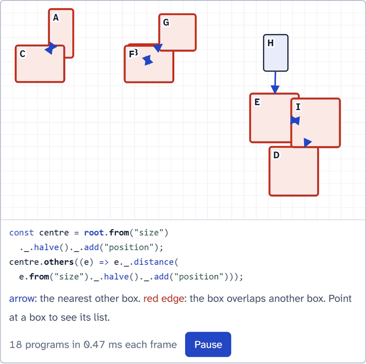

# Vex

[](https://www.npmjs.com/package/@mark1russell7/vex) [](https://github.com/mark1russell7/vex/actions/workflows/ci.yml) [](https://mark1russell7.github.io/vex/) [](./LICENSE)

Vex is a TypeScript library for typed spreadsheet formulas over domain objects.

<p align="center">
  <a href="https://mark1russell7.github.io/vex/">
    <picture>
      <source media="(prefers-color-scheme: dark)" srcset="docs/assets/hero-dark.gif">
      
    </picture>
  </a>
</p>

**[The site](https://mark1russell7.github.io/vex/)** has a tour, live examples, the Lab and the specification with the test status of each rule.

```sh
npm install @mark1russell7/vex @mark1russell7/vex-domains
```

A Vex program runs at one position in a collection of records. It reads fields relative to that position, combines them with domain operations, and gives a total result. A failure does not throw. It gives an error value that tells you what went wrong. Axes lift one program to all positions, or to relations between positions.

```ts doctest
import { space, vex } from "@mark1russell7/vex";
import { Vec2, Vec2Domain } from "@mark1russell7/vex-domains";

const A = { position: new Vec2(2, 2), size: new Vec2(5, 4) };
const B = { position: new Vec2(6, 5), size: new Vec2(4, 4) };

const separated = vex(Vec2Domain)
  .over(space.record({ A, B }))
  .from("position")._.add("size")
  .other()._.subtract("position")
  ._.anyNonPositive();

separated.at("A"); // : Optional<boolean>
separated.at("A"); // => { tag: "some", value: false }
separated.explain("A"); // a trace of each step
```

## Status

The packages are on npm (see the badge for the version). The specification (Vex 1.0) is in [`spec/README.md`](./spec/README.md), and the plan is in [`docs/REVIEW.md`](./docs/REVIEW.md). The code before the rebuild is in the git history (package `@vex/legacy`, removed after the parity tests passed).

| Package | Contents |
|---|---|
| [`@mark1russell7/vex`](./packages/core) | The kernel: spaces, addresses, the expression IR, domains, the interpreter, traces |
| [`@mark1russell7/vex-domains`](./packages/domains) | Domains for 2D vectors, named-component vectors, colors and angles |
| [`@mark1russell7/vex-testkit`](./packages/testkit) | Arbitraries, law checks and the reference interpreter for property tests |
| [`@vex/pilots`](./packages/pilots) | Programs of other projects in Vex: the grid layout of Graph |
| [`@vex/cli`](./packages/cli) | The workspace commands of the template |

## Commands

```sh
pnpm install
pnpm typecheck       # the source and the tests of each package
pnpm test            # the tests of each package
pnpm test:coverage   # the coverage of @mark1russell7/vex, with thresholds
pnpm test:docs       # the code blocks of the docs with the meta word "doctest"
pnpm lint            # Oxlint with type-aware rules
pnpm lint:ste        # the writing rules
pnpm check           # each of the commands above
pnpm --filter @mark1russell7/vex run bench          # the speed lane (report only)
pnpm --filter @vex/mutation run mutation   # the mutation lane (Stryker)
pnpm package add <name> --preset=ts        # make a new package
```

## Documents

- [`docs/REVIEW.md`](./docs/REVIEW.md): the review, the target architecture and the plan
- `docs/research/`: the research reports of the review. They contain local paths, so they stay out of the repository.
- [`docs/archive/`](./docs/archive): the July 2026 audit and the old v0.9 spec

## Writing style

The prose of this repository follows ASD-STE100 Simplified Technical English (STE). STE is a style target. ASD does not certify this repository. The project glossary is in `ste.config.json`. Keep a local copy of the STE dictionary in `.ste/`, and do not commit it.

## Disclosure

An AI model (Claude, from Anthropic) wrote most of the text and the code of this repository, under the direction of the author. The STEMG of ASD-STE100 asks for this disclosure in its white paper on STE and artificial intelligence (June 2026).

## License

MIT. Refer to [`LICENSE`](./LICENSE).
